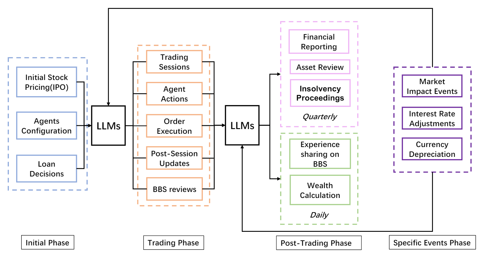

# When AI Meets Finance: StockAgent for LLM-based Financial Assistant


Can we adjust our purchasing strategies in a timely manner to maximize profits in stock trading? This question frequently arises among investors. The pursuit of maximum profit is a primary motivation for investors in stock trading. This study aims to address this question with the latest advancements in Artificial Intelligence and Large Language Models (LLMs). We have developed a multi-agent AI system called stock agent, driven by LLMs, designed to simulate the trading behaviors of investors in response to new stock offerings. This system allows us to assess the merits of different trading strategies and to analyze the performance of economic behaviors and the consequences of decision-making. By evaluating the effects of these simulations, we investigate the progress and limitations of cutting-edge AI systems in studying complex human collective behaviors, such as the differences in trading approaches influenced by various public opinions in forums. The emerging interactions among agents in these simulations also provide a novel perspective on the selection of stock profitability behaviors and the underlying conditions. Our research results offer data-driven and AI-enhanced insights that could redefine how to choose the path to maximize profits.

## Architecture


The Workflow of Trading Simulation Flow. There are four Phases, namely **Initial Phase**, **Trading Phase**, **Post-Trading Phase** and **Special Events Phase**. In the Post-Trading Phase, Daily events and Quarterly events occur with daily and quarterly frequency respectively. A Specific Events Phase is an event that occurs randomly and acts on a random trading day.

## Quick Start

#### Environment

```
conda create --name stockagent python=3.9
conda activate stockagent

git clone https://github.com/dhh1995/PromptCoder
cd PromptCoder
pip install -e .
cd ..

git clone https://github.com/jmyissb/Stockagent.git
cd Stockagent
pip install -r requirements.txt
```

#### API keys

Use GPTs as agent LLM:

```
export OPENAI_API_KEY=YOUR_OPENAI_API_KEY
```

Use Gemini as agent LLM:

```
export GOOGLE_API_KEY=YOUR_GEMINI_API_KEY
```

#### Start simulation

You can choose a basic LLM and start simulation in one line:

```
python main.py --model MODEL_NAME
```

We set gemini-pro for default LLM.