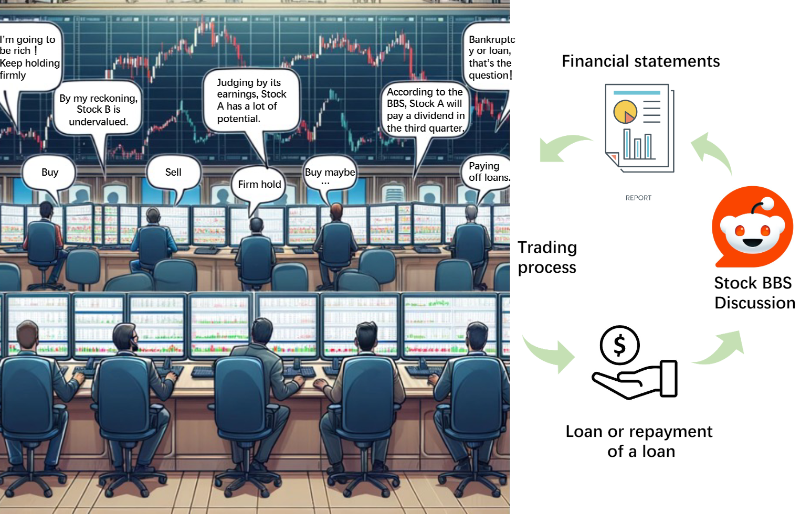
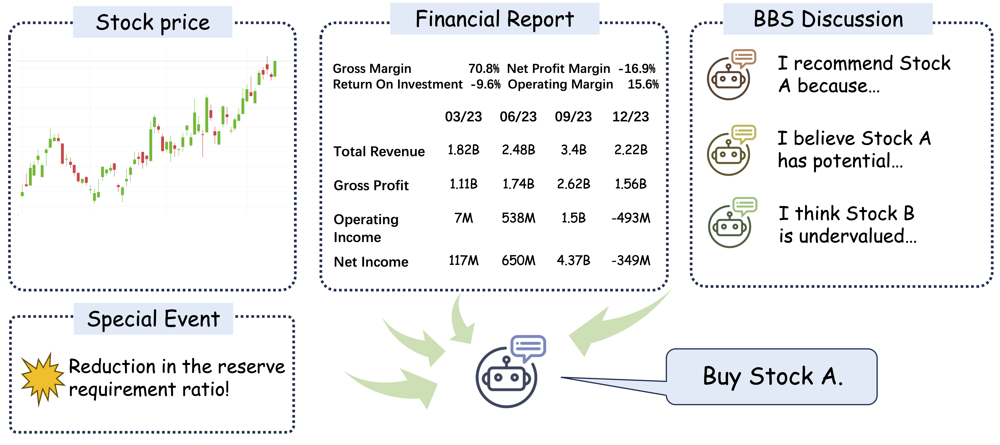
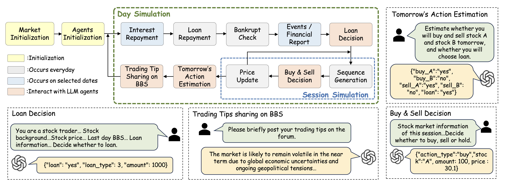

# When AI Meets Finance (StockAgent): Large Language Model-based Stock Trading in Simulated Real-world Environments

## ⚠️ ÖNEMLI UYARI / IMPORTANT DISCLAIMER

**🇹🇷 TÜRKÇE:**

Bu proje **yatırım tavsiyesi değildir**. Tamamen eğitim, test ve kişisel hobi amaçlı geliştirilmiştir. 

- ❌ Bu sistemden elde edilen sonuçlar kesinlikle gerçek yatırım kararları için kullanılmamalıdır
- ❌ AI modelleri hata yapabilir ve geçmiş performans gelecekteki sonuçları garanti etmez
- ❌ Finansal piyasalar öngörülemezdir ve kayıp riski her zaman mevcuttur
- ✅ Gerçek yatırım yapmadan önce profesyonel bir finansal danışmana başvurun
- ✅ Yatırım kararları tamamen kendi sorumluluğunuzdadır

**🇬🇧 ENGLISH:**

This project is **NOT financial advice**. It is developed purely for educational, testing, and personal hobby purposes.

- ❌ Results from this system should never be used for real investment decisions
- ❌ AI models can make mistakes and past performance does not guarantee future results
- ❌ Financial markets are unpredictable and risk of loss always exists
- ✅ Consult a professional financial advisor before making real investments
- ✅ Investment decisions are entirely your own responsibility

---




Can AI Agents simulate real-world trading environments to investigate the impact of external factors on stock trading activities (e.g., macroeconomics, policy changes, company fundamentals, and global events)? These factors, which frequently influence trading behaviors, are critical elements in the quest for maximizing investors' profits. Our work attempts to solve this problem through large language model-based agents. We have developed a multi-agent AI system called StockAgent, driven by LLMs,  designed to simulate investors' trading behaviors in response to the real stock market. The StockAgent allows users to evaluate the impact of different external factors on investor trading and to analyze trading behavior and profitability effects. Additionally, StockAgent avoids the test set leakage issue present in existing trading simulation systems based on AI Agents. Specifically, it prevents the model from leveraging prior knowledge it may have acquired related to the test data. We evaluate different LLMs under the framework of StockAgent in a stock trading environment that closely resembles real-world conditions. The experimental results demonstrate the impact of key external factors on stock market trading, including trading behavior and stock price fluctuation rules. This research explores the study of agents' free trading gaps in the context of no prior knowledge related to market data. The patterns identified through StockAgent simulations provide valuable insights for LLM-based investment advice and stock recommendation. 

## Link
ARXIV LINK: https://arxiv.org/pdf/2407.18957
## Architecture


The Workflow of Trading Simulation Flow. There are four Phases, namely **Initial Phase**, **Trading Phase**, **Post-Trading Phase** and **Special Events Phase**. In the Post-Trading Phase, Daily events and Quarterly events occur with daily and quarterly frequency respectively. A Specific Events Phase is an event that occurs randomly and acts on a random trading day.

## Quick Start

#### Environment

```
conda create --name stockagent python=3.9
conda activate stockagent

git clone https://github.com/dhh1995/PromptCoder
cd PromptCoder
pip install -e .
cd ..

git clone <This Github Project>
cd Stockagent
pip install -r requirements.txt
```

#### API keys

Use GPTs as agent LLM:

```
export OPENAI_API_KEY=YOUR_OPENAI_API_KEY
```

Use Gemini as agent LLM:

```
export GOOGLE_API_KEY=YOUR_GEMINI_API_KEY
```

#### Start simulation

You can choose a basic LLM and start simulation in one line:

```
python main.py --model MODEL_NAME
```

We set gemini-pro for default LLM.

#### About ’procoder‘

Here we use the: https://github.com/dhh1995/PromptCoder.git this tool, please download after its installation.

#### Citation
If you find the code is valuable, please use this citation.
```
@article{zhang2024ai,
  title={When AI Meets Finance (StockAgent): Large Language Model-based Stock Trading in Simulated Real-world Environments},
  author={Zhang, Chong and Liu, Xinyi and Jin, Mingyu and Zhang, Zhongmou and Li, Lingyao and Wang, Zhengting and Hua, Wenyue and Shu, Dong and Zhu, Suiyuan and Jin, Xiaobo and others},
  journal={arXiv preprint arXiv:2407.18957},
  year={2024}
}
```


